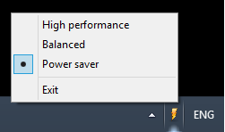

# &nbsp; Power manager

Choose your power schema without any limitations
>  

## Getting started

- Obtain stable version and install <a href="http://itradce.cz/downloads/powermanager/setup.exe">setup.exe</a>

## Motivation

- Easy setup. Just a few steps
- It'll run on startup
- Change power scheme by two clicks
